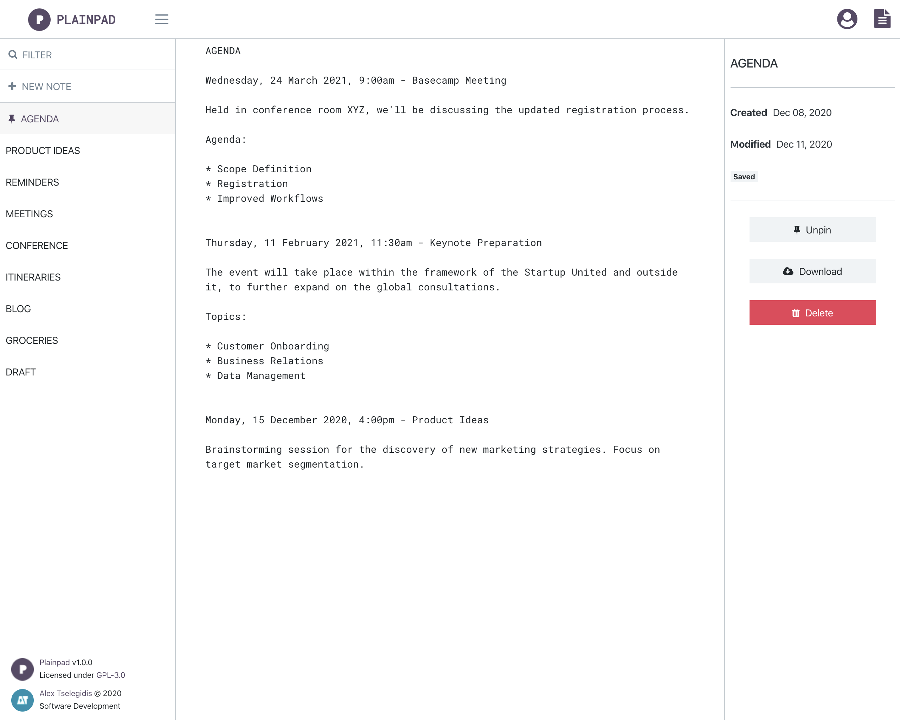

<!--
N.B.: This README was automatically generated by <https://github.com/YunoHost/apps/tree/master/tools/readme_generator>
It shall NOT be edited by hand.
-->

# Plainpad for YunoHost

[](https://dash.yunohost.org/appci/app/plainpad)  

[](https://install-app.yunohost.org/?app=plainpad)

*[Read this README in other languages.](./ALL_README.md)*

> *This package allows you to install Plainpad quickly and simply on a YunoHost server.*  
> *If you don't have YunoHost, please consult [the guide](https://yunohost.org/install) to learn how to install it.*

## Overview

Plainpad is a self hosted, open source note taking application that is very easy to setup on your server. Your data will never leave your server and you will be able to access them from any device connected to the internet.
With Plainpad you can allow multiple users to access the application without being able to see each other's notes. The notes are being encrypted and stored safely in the database.

**Shipped version:** 1.0.2024.04.15~ynh1

**Demo:** <https://alextselegidis.com/try/plainpad/#/login>

## Screenshots



## Documentation and resources

- Official app website: <https://alextselegidis.com/get/plainpad>
- Official admin documentation: <https://alextselegidis.com/get/plainpad/self-hosted>
- Upstream app code repository: <https://github.com/alextselegidis/plainpad>
- YunoHost Store: <https://apps.yunohost.org/app/plainpad>
- Report a bug: <https://github.com/YunoHost-Apps/plainpad_ynh/issues>

## Developer info

Please send your pull request to the [`testing` branch](https://github.com/YunoHost-Apps/plainpad_ynh/tree/testing).

To try the `testing` branch, please proceed like that:

```bash
sudo yunohost app install https://github.com/YunoHost-Apps/plainpad_ynh/tree/testing --debug
or
sudo yunohost app upgrade plainpad -u https://github.com/YunoHost-Apps/plainpad_ynh/tree/testing --debug
```

**More info regarding app packaging:** <https://yunohost.org/packaging_apps>
