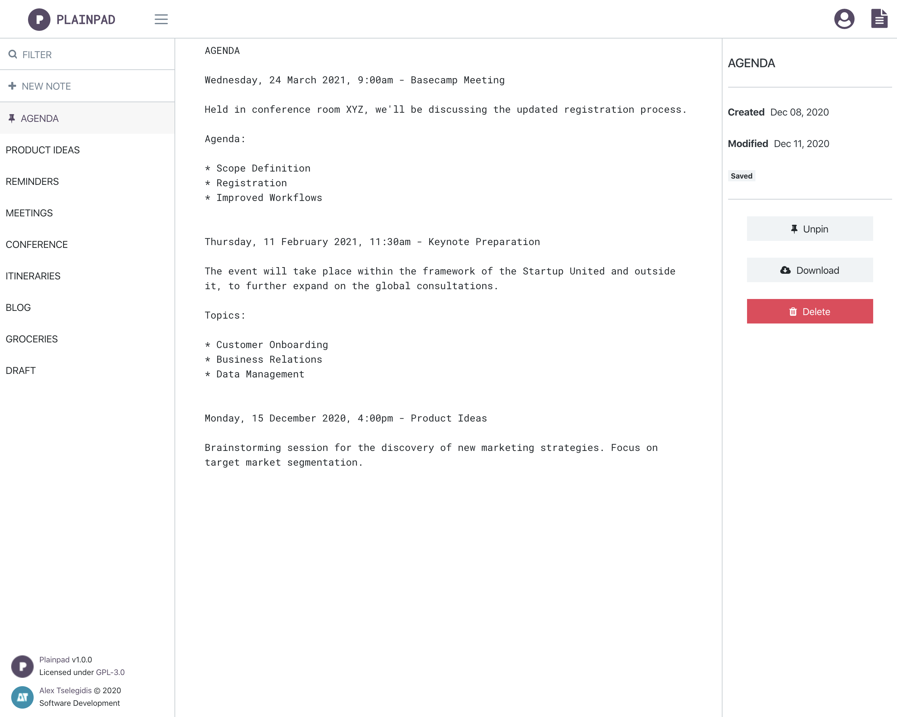

<!--
N.B.: README ini dibuat secara otomatis oleh <https://github.com/YunoHost/apps/tree/master/tools/readme_generator>
Ini TIDAK boleh diedit dengan tangan.
-->

# Plainpad untuk YunoHost

[](https://ci-apps.yunohost.org/ci/apps/plainpad/)


[](https://install-app.yunohost.org/?app=plainpad)

*[Baca README ini dengan bahasa yang lain.](./ALL_README.md)*

> *Paket ini memperbolehkan Anda untuk memasang Plainpad secara cepat dan mudah pada server YunoHost.*  
> *Bila Anda tidak mempunyai YunoHost, silakan berkonsultasi dengan [panduan](https://yunohost.org/install) untuk mempelajari bagaimana untuk memasangnya.*

## Ringkasan

Plainpad is a self hosted, open source note taking application that is very easy to setup on your server. Your data will never leave your server and you will be able to access them from any device connected to the internet.
With Plainpad you can allow multiple users to access the application without being able to see each other's notes. The notes are being encrypted and stored safely in the database.

**Versi terkirim:** 1.0.0~ynh3

**Demo:** <https://alextselegidis.com/try/plainpad/#/login>

## Tangkapan Layar



## Dokumentasi dan sumber daya

- Website aplikasi resmi: <https://alextselegidis.com/get/plainpad>
- Dokumentasi admin resmi: <https://alextselegidis.com/get/plainpad/self-hosted>
- Depot kode aplikasi hulu: <https://github.com/alextselegidis/plainpad>
- Gudang YunoHost: <https://apps.yunohost.org/app/plainpad>
- Laporkan bug: <https://github.com/YunoHost-Apps/plainpad_ynh/issues>

## Info developer

Silakan kirim pull request ke [`testing` branch](https://github.com/YunoHost-Apps/plainpad_ynh/tree/testing).

Untuk mencoba branch `testing`, silakan dilanjutkan seperti:

```bash
sudo yunohost app install https://github.com/YunoHost-Apps/plainpad_ynh/tree/testing --debug
atau
sudo yunohost app upgrade plainpad -u https://github.com/YunoHost-Apps/plainpad_ynh/tree/testing --debug
```

**Info lebih lanjut mengenai pemaketan aplikasi:** <https://yunohost.org/packaging_apps>
